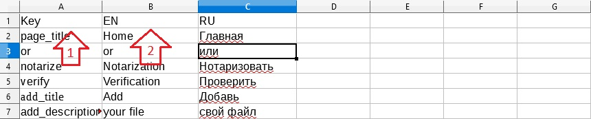
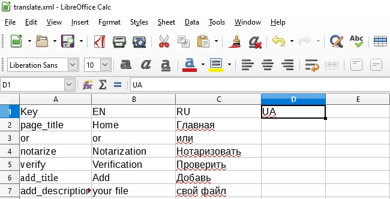
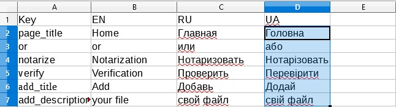

# Modules in the project

The project modules are in the directory `src/modules/`.

## Module structure:

* {moduleName}
  * [view](#view)
        * {pageName}
            * index.js
  * [reducers](#reducers)
  * [index.js](#indexjs) 
  * [package.json](#packagejson)
  * [routes.js](#routesjs)
  * [translate.xml](#translatexml)
  
### view 

This directory stores the module page. 
Each page is in its directory. The entry point for a page is a file `index.js`.
The page code must be `export default`.

Example page:

```jsx

import React, {Component} from 'react';

class PageName extends Component {
  render() {
    return (<div>
    Hello world!
</div>)
  }
}

export default PageName;
```

### reducers

in developing


### index.js

Entry point to the module.

```js
import React from 'react';
import { routes } from './routes';

export default {
  routes,
};
```

### package.json

Required for each module file, without it the module will not be included in the assembly.

* name - the name of the module must match the directory name
* main - the file name being the entry point
* translate - array of translations available for the module, description of the object:
  * "ISO Code" - language code, [ISO_3166](http://kirste.userpage.fu-berlin.de/diverse/doc/ISO_3166.html)
  * language - full name of the language will be displayed in the user interface
  * active - do I include the language in the assembly
  * default - whether the selected language is the default language, 
  if the module does not have the required language, select the default language or the first
  
```json
{
  "name": "moduleName",
  "version": "0.0.1",
  "private": true,
  "main": "./index.js",
  "translate": [
    {
      "ISO Code": "en",
      "language": "English",
      "active": true,
      "default": false
    }
  ]
}
```

### routes.js

List of module routes. there must be at least one route.

* exact - [react-router](https://reacttraining.com/react-router/web/api/Route/exact-bool)
* title - the title of the page will be presented in the title tag in the head, you can specify the key from the dictionary
* path -the path by which the page will be accessible
* load - the function of dynamically import your page, use dynamic imports for code splitting
* component - here is simply passed jsx your page, do not use this method for production

```js
export const routes = [
   {
      exact: true,
      title: 'Distributor',
      path: '/distributor',
      load: () => import('./view/distributor'),
    },
]
```

### translate.xml


The localization files are updated when you create a new project assembly and restart it.

At the root of each module is stored its dictionary in the file `translate.xml`,
the configuration of the dictionary is in `package.json` in the` translate` section, the description of the parameters can be found
in the  section [Modules in the project](./module.md#packagejson).

To add a new language to the project, you must:

1. open the directory `src / modules`;
2. open the directory of the desired module
3. Open the translate.xml file in the MS Excel editor, Libra Office, Open Office or any other one that reads this format
4. In the table below: 1) the key to receive translation in the markup, 2) the language code



5. In the first line after the last language, enter a new key:



6. Under the new key, write translations into this language:



7. Save the file, in the format of Microsoft Excel 2003 XML Format;
8. Add a new language in `package.json` in the` translate` section as described in [Modules in the project](./module.md#packagejson).
9. Rebuild the project with `npm run build`
10. Restart the server node.js.