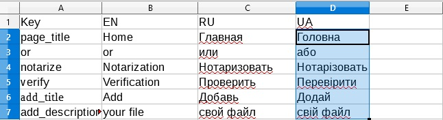

# Локализация интерфейса

Файлы локализации обновляется при создании новой сборки проекта и его перезапуске. 

В корне каждого модуля хранится его словарь в файле `translate.xml`, 
конфигурация словаря находится в `package.json` в разделе `translate`, описание параметров можно узнать 
в разделе [Modules in the project](./module.md#packagejson).

Для того чтобы добавить новый язык в проект необходимо:

1. открыть дирректорию `src/modules`;
2. открыть дирректорию нужного модуля
3. открыть файл translate.xml в редаторе MS Excel, Libra Office, Open Office или любой другой читающий этот формат
4. в таблице ниже: 1) ключ для получения перевода в разметке, 2) код языка

5. В первую строку после последнего языка вписываете новый ключ:

6. Под новым ключем пишите переводы на этот язык:

7. Сохраните файл, оязательно в формате Microsoft Excel 2003 XML Format;
8. Добавьте новый язык в `package.json` в разделе `translate` как указано в разделе [Modules in the project](./module.md#packagejson).
9. Пересоберите проект командой `npm run build` 
10. Перезапустите сервер node.js.
    

